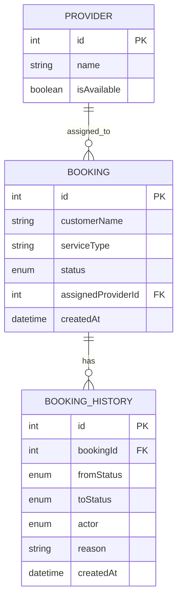

# 🏠 Home Services Booking System – Assignment

This project implements a core booking lifecycle for an on-demand home services marketplace, where customers create service bookings and providers fulfill them. The system demonstrates real-world backend workflows, state transitions, and operational edge cases with a simple frontend for interaction.

## 🚀 Tech Stack

### Backend 
Node.js, Express.js, MySQL, Sequelize ORM, REST APIs

### Frontend
React (Vite) ,Tailwind CSS , React Router

## 🎯 Scope & Key Features

### Booking Lifecycle
- Create booking (PENDING)
- Auto assign provider (ASSIGNED)
- Provider starts work (IN_PROGRESS)
- Provider completes work (COMPLETED)
- Admin can override booking state at any time

### Provider Workflow
- View assigned bookings
- Accept or reject bookings
- Start and complete jobs
- Automatic retry assignment if provider rejects

### Admin / Ops Capabilities
- View all bookings
- Override booking status
- Reassign providers manually
- Capture reason for every admin action
- View booking history (state changes)

### Failure & Edge Case Handling
- Provider rejection and retry logic
- Provider availability management
- Admin override for stuck or failed states
- Audit logging for every status change

## 🧭 Quick Demo Flow (How to Review This Project)

1. Start the backend and frontend (instructions below)
2. Go to **User → Create Booking**
3. Create a booking (status starts as `PENDING`)
4. System auto-assigns a provider (`ASSIGNED`)
5. Go to **Provider → Select Provider → Dashboard**
   - Accept / reject / start / complete bookings
6. Go to **Admin → Dashboard**
   - Override booking status
   - Reassign providers
   - Add operational reasons
7. Go back to **User Dashboard**
   - View booking history and timeline

This flow demonstrates the complete booking lifecycle end-to-end.

## 🧠 Design Decisions & Trade-offs

This section explains why certain design choices were made, what alternatives existed, and why they were intentionally not chosen for this assignment.

### 🧑‍🤝‍🧑1. Role-Based Workflow Without Authentication
**Decision:**
- Authentication and authorization were intentionally skipped. 
- Instead, role-based dashboards (User, Provider, Admin) are exposed directly via frontend navigation.

**Why this approach was chosen:**
- The assignment focuses on booking lifecycle, state transitions, and edge cases, not user identity management.
- Adding authentication would increase complexity without improving the evaluation of core system behavior.
- This approach allows reviewers to quickly test all roles without setup overhead.

**Trade-off:**
- In a real production system, access control would be required.
- For this assignment, skipping auth keeps the system focused, testable, and aligned with the problem statement.

**Future improvement:**
- JWT-based authentication
- Role-based access control (RBAC)
- Provider-specific authorization checks

### 🔄2. Explicit Booking State Machine
**Decision:**
- Booking states are explicitly defined and enforced:
- PENDING → ASSIGNED → IN_PROGRESS → COMPLETED
-        → FAILED / CANCELLED

- Every transition is validated and logged.

**Why this approach was chosen:**
- Booking systems are state-driven, and implicit transitions often lead to bugs.
- Explicit states prevent invalid operations (e.g., completing a booking that was never started).
- Makes system behavior predictable and easier to reason about.

**Trade-off:**
- Requires more validation logic.
- Slightly more code compared to allowing free-form updates.

**Why it’s worth it:**
- Prevents data inconsistency.
- Makes debugging and operational support easier.
- Aligns with real-world marketplace systems.

### 🏗️3. Layered Backend Architecture (Controller → Service → Repository)

**Decision:**
- Backend logic is separated into clear layers:
- Controllers: HTTP request handling
- Services: Business logic
- Repositories: Database access
- Models: ORM definitions

**Why this approach was chosen:**
- Keeps business logic independent of HTTP and database concerns.
- Improves readability and maintainability.
- Makes the system easier to extend (e.g., adding new workflows or validations).

**Trade-off:**
- More files compared to a simple monolithic controller.
- Slightly higher initial setup effort.

**Why it’s acceptable:**
- This structure scales well as features grow.
- Reflects real-world backend engineering practices.

### 🛠️4. Admin Actions with Explicit Audit Trail

**Decision:**
- All admin actions (status override, provider reassignment) are logged with:
- Previous status
- New status
- Actor (ADMIN)
- Optional reason

**Why this approach was chosen:**
- Operational systems require accountability.
- Admin overrides are powerful and should be traceable.
- Capturing reason improves transparency and debugging.

**Trade-off:**
- Slightly more UI and backend logic.
- Requires maintaining booking history records.

**Why it matters:**
- Enables operational visibility.
- Matches how real ops dashboards work.
- Makes post-incident analysis possible.

### ✍️5. Optional Reason Input (Not Mandatory)

**Decision:**
- Reason fields for admin actions are optional, not required.

**Why this approach was chosen:**
- Avoids slowing down operations.
- Allows fast actions during high-volume scenarios.
- Still encourages documentation when needed.

**Trade-off:**
- Some actions may not have a reason attached.

**Why it’s acceptable:**
- System design balances speed vs documentation.
- In real systems, optional fields are common for ops tools.

### 🔁6. Provider Auto-Assignment with Retry Logic

**Decision:**
- Providers are auto-assigned based on availability.
- If a provider rejects a booking, the system retries assignment with another available provider.

**Why this approach was chosen:**
- Demonstrates handling of real-world failure scenarios.
- Prevents bookings from getting stuck.
- Keeps customer experience smooth.

**Trade-off:**
- Assignment logic is simple (first available provider).
- Does not consider advanced matching criteria.

**Future improvement:**
- Skill-based provider matching
- Load balancing
- Geo-based assignment

### 🎯7. Frontend Focused on Workflow Clarity

**Decision:**
- The frontend is designed to clearly expose system workflows rather than prioritize visual complexity.

**Why this approach was chosen:**
- The primary goal is to make booking state transitions, provider actions, and admin overrides easy to observe and test.
- This ensures reviewers can validate backend behavior without UI distractions.

**Trade-off:**
- UI styling is functional rather than production-polished.

**Why it’s acceptable:**
- The UI remains clean, usable, and purpose-driven.
- All critical workflows are fully accessible and traceable.

## 📌 Assumptions
- Single service per booking
- One provider per booking at a time
- No authentication (focus on system behavior)
- Providers have availability flag (isAvailable)

## 📊 Entity Relationship Diagram

### Explanation
- Booking represents a customer service request and maintains the current lifecycle state.
- Provider fulfills bookings and can be assigned to multiple bookings over time.
- BookingHistory records every state transition (including admin overrides) for auditability.
- This design enables full lifecycle traceability, operational visibility, and safe manual intervention without data inconsistency.

## 📁 Project Structure
```bash
Home-Service/
├── Backend/
│   ├── src/
│   │   ├── controllers/     # HTTP request handling
│   │   ├── services/        # Business logic
│   │   ├── repositories/    # Database access
│   │   ├── models/          # Sequelize models
│   │   ├── routes/          # API routes
│   │   ├── utils/           # Helpers & constants
│   │   └── server.js
│   └── package.json
│
├── Frontend/
│   └── client/
│       ├── src/
│       │   ├── pages/       # Route-level pages
│       │   ├── components/  # Reusable UI components
│       │   ├── routes/      # React Router config
│       │   └── api/         # API abstraction layer
│       └── package.json
│
└── README.md
```
## ▶️ How to Run the Project

### Prerequisites
- Node.js (v18+ recommended)
- MySQL (running locally)
- npm

### 1️⃣ Backend Setup
```
cd Backend
npm install
```
### Create a .env file inside Backend/:
```
PORT=<Your_Port_number> Eg: 3000 , 4000 etc.
```

### inside Backend -> src -> config -> config.json write the code given below
```
{
  "development": {
    "username": "root",
    "password": <Your_Password>,
    "database": <Database_name>,
    "host": "127.0.0.1",
    "dialect": "mysql"
  },
  "test": {
    "username": "root",
    "password": null,
    "database": "database_test",
    "host": "127.0.0.1",
    "dialect": "mysql"
  },
  "production": {
    "username": "root",
    "password": null,
    "database": "database_production",
    "host": "127.0.0.1",
    "dialect": "mysql"
  }
}
```

### Run database migrations & seeders:
```
npx sequelize db:migrate
npx sequelize db:seed:all
```

### Start backend server:
```
npm run dev
```

** Backend runs on: **
http://localhost:3000

## 2️⃣ Frontend Setup
```
cd Frontend/client
npm install
```
### Create .env inside Frontend
```
VITE_API_BASE_URL=http://localhost:3000/api
```
### Start Frontend
```
npm run dev
```
** Frontend runs on **
http://localhost:5173

## 🧪 Testing the System
### User
- Create a booking
- View booking status updates

### Provider
- View assigned bookings
- Accept / reject / start / complete jobs

### Admin
- Override booking status
- Reassign providers
- Enter reason for operational actions

## 🖼️ Application Snapshots
### 👤 User Flow
- Create booking


### 🧑‍🔧 Provider Flow
- View assigned bookings
- Accept / Reject / Start / Complete


### 🛠️ Admin Flow
- View all bookings
- Override status
- Reassign provider
- Reason & audit trail


## 🚀 Production Improvements (Future Scope)

If extended beyond this assignment, the following improvements would be added:

- Authentication & Authorization (JWT + RBAC)
- Provider skill-based and location-based matching
- Concurrency handling for provider assignment
- Pagination and filtering for admin dashboards
- WebSocket / real-time updates for booking status
- Centralized logging and monitoring
- Rate limiting and request validation


## 🙌 Final Notes
This project intentionally prioritizes backend correctness, state handling, and operational workflows over UI polish, aligning with the assignment focus.

## 👤 Author
**Ashish Kumar**
